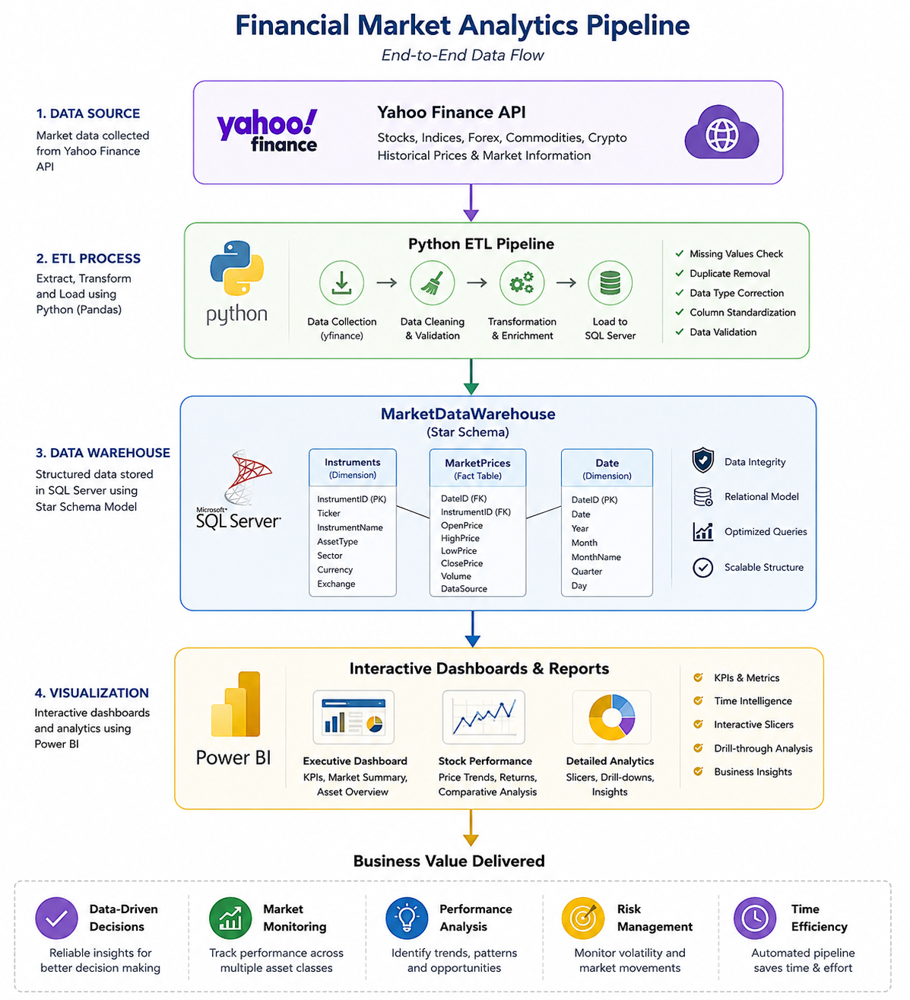
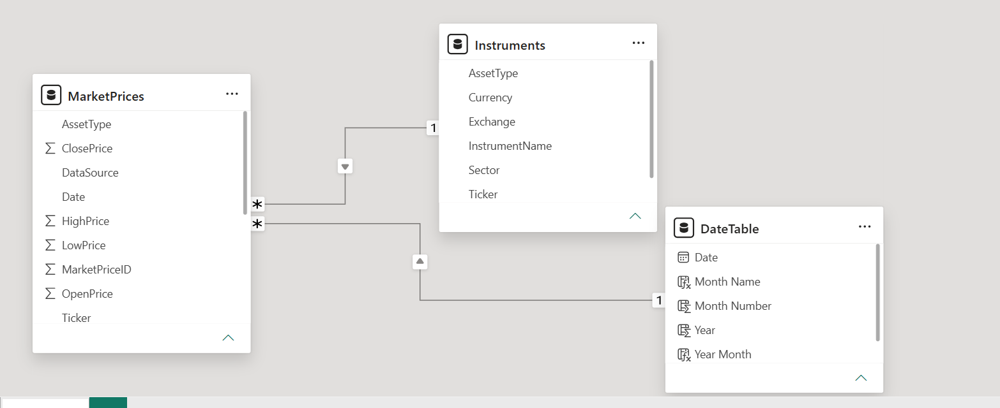
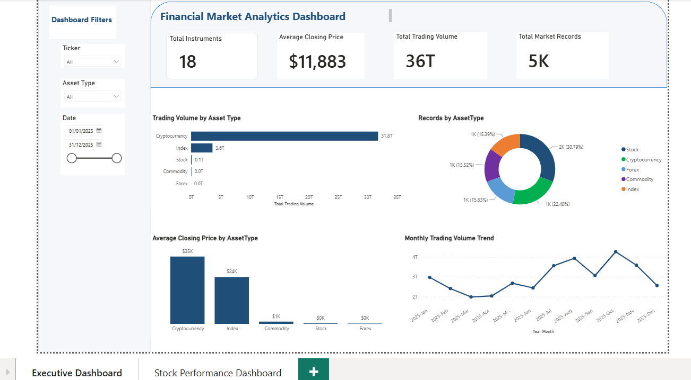
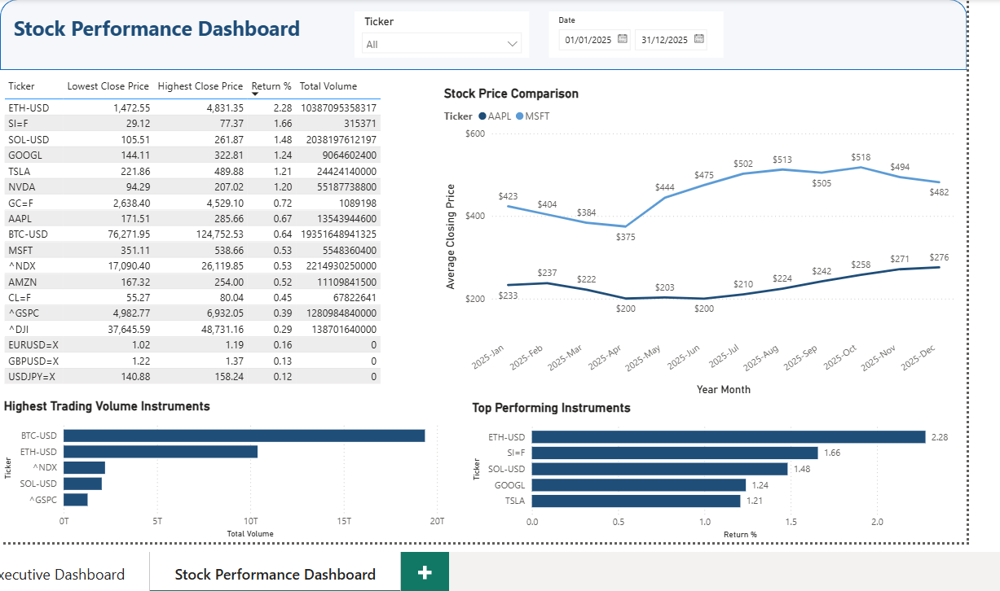

# 📈 Financial Market Analytics Dashboard

## 📌 Project Overview

This project demonstrates an end-to-end Business Intelligence solution for financial market analysis using **Python**, **SQL Server**, and **Power BI**.

The objective was to collect historical market data from Yahoo Finance, build an ETL pipeline, design a SQL Server data warehouse using a Star Schema, perform business-focused SQL analysis, and develop interactive Power BI dashboards that support data-driven decision-making.

---

# 🏗️ Project Architecture



The project follows a modern Business Intelligence workflow:

Yahoo Finance API

↓

Python ETL Pipeline

↓

SQL Server Data Warehouse

↓

Power BI Dashboard

---

# ⚙️ Technologies Used

- Python
- Pandas
- SQLAlchemy
- Yahoo Finance API (yfinance)
- Microsoft SQL Server
- SQL
- Power BI
- DAX
- Jupyter Notebook

---

# 🔄 ETL Pipeline

The project follows a complete Extract–Transform–Load (ETL) process.

### Extract

- Retrieved historical market data from Yahoo Finance API.
- Collected data for Stocks, Indices, Commodities, Forex, and Cryptocurrencies.

### Transform

- Cleaned missing values.
- Removed duplicate records.
- Standardized column names and data types.
- Validated data quality.
- Added Asset Type and Data Source information.

### Load

- Loaded cleaned datasets into SQL Server using SQLAlchemy.
- Built a Star Schema for analytical reporting.

---

# 🗄️ Data Warehouse Design

The SQL Server database follows a Star Schema model.

## Fact Table

**MarketPrices**

Contains daily market information:

- Date
- Ticker
- Open Price
- High Price
- Low Price
- Close Price
- Volume

## Dimension Table

**Instruments**

Contains descriptive information:

- Instrument Name
- Asset Type
- Sector
- Currency
- Exchange

## Calendar Table

Used for:

- Monthly analysis
- Time intelligence
- Trend analysis

---

# 📊 Data Model



The model uses one-to-many relationships between dimension tables and the MarketPrices fact table.

---

# 💡 Business Questions

The project answers the following business questions:

1. How many market records exist for each asset class?
2. Which asset class has the highest average closing price?
3. Which instruments have the highest average closing prices?
4. Which instruments have the highest reported trading volume?
5. Which stocks have the highest trading volume?
6. Which stock reached the highest closing price?
7. Which stock achieved the highest percentage return?
8. Which asset class shows the highest price variability?
9. Which month recorded the highest stock trading activity?
10. How can stock performance be summarized for decision-making?

---

# 📈 Executive Dashboard



The Executive Dashboard provides a high-level overview of market activity through:

- KPI Cards
- Trading Volume Analysis
- Average Closing Prices
- Asset Distribution
- Monthly Trading Trends
- Interactive Filters

---

# 📉 Stock Performance Dashboard



The Stock Performance Dashboard enables detailed analysis of individual stocks through:

- Price Comparison
- Performance Ranking
- Trading Volume Analysis
- Return Percentage
- Interactive Filtering

---

# 🛠️ Skills Demonstrated

This project demonstrates practical experience in:

- ETL Pipeline Development
- Data Cleaning & Validation
- SQL Server Data Warehousing
- Star Schema Design
- SQL Business Analysis
- Window Functions
- Common Table Expressions (CTEs)
- DAX Measures
- Power BI Dashboard Development
- Financial Market Analytics
- Business Intelligence Reporting

---

# 📁 Repository Structure

```text
Financial-Market-Analytics-Dashboard
│
├── python/
├── sql/
├── powerbi/
├── README.md
└── LICENSE
```

---

# 🚀 Future Improvements

Potential enhancements include:

- Live API refresh
- Azure SQL Database deployment
- Power BI Service integration
- Automated ETL scheduling
- Additional financial KPIs
- Real-time market monitoring

---

# 👤 Author

**Khayal Dadashzade**

If you found this project interesting, feel free to connect with me on LinkedIn or explore my other repositories.
